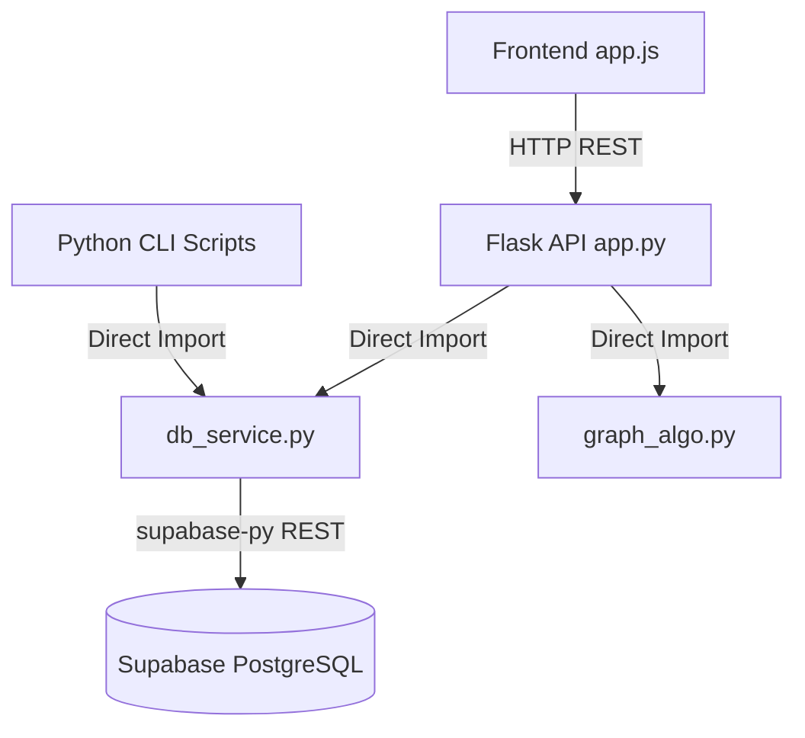

# 🎯 Splitwise Clone: Technical Interview Guide

This guide breaks down every piece of the architecture, data flow, and algorithmic logic so you can confidently explain the entire full-stack pipeline in an interview.

---

## 1. System Architecture Overview
*(How the pieces connect)*

The project is natively built on a decoupled 3-tier architecture:
1. **Frontend:** Pure HTML/CSS/Vanilla JS. No complex frameworks.
2. **Backend Engine:** Python Flask REST API.
3. **Data Layer:** Supabase (PostgreSQL).

*Interview Talking Point:* "I intentionally decoupled the `db_service.py` file from the Flask API logic. This allowed me to run standalone Python CLI scripts directly against the database logic without having to boot up the web-server or mimic HTTP calls."

---

## 2. Database Design (Why 10 Tables?)

In a system design interview, emphasis on **Database Normalization** is critical. A naive prototype implementation uses 2 tables (Users and Expenses) and shoves JSON arrays inside them. We chose strict normalization (1NF, 2NF, 3NF compliance):

- **Core Setup:** `users`, `groups`, `group_members`, `categories`
- **The Expense Triad:** 
    - `expenses` (The overarching receipt: Total Amount, Date)
    - `expense_payers` (Who specifically handed physical cash to the merchant?)
    - `expense_splits` (Who mathematically consumed the value?)
- **Caching & Ledgers:**
    - `user_balances_cache`: A globally maintained tally of exactly how much money a user is up or down in a group. Avoids heavily expensive SQL aggregate `SUM()` queries spanning 10,000 expenses.
    - `transactions`: The computed "Owe Graph" output (useful so massive groups don't have to recalculate the algorithm on every visual page refresh).
    - `settlements`: Real-world cash transferring (User A clicks 'Pay Now' because they Venmo'd User B).

---

## 3. The Backend API & Data Flow (`app.py` & `db_service.py`)

**The Execution Flow:**
1. A user clicks "Save Expense" on the frontend. `app.js` collects the splits from the UI and fires `fetch('/api/expenses', { method: 'POST' ... })`.
2. `app.py` catches the POST request and extracts the JSON dictionary. 
3. It filters the data and passes it exclusively to `add_expense()` in `db_service.py`.
4. `db_service.py` operates as the abstraction layer, running Supabase `.insert().execute()` SQL commands.
5. Inside `add_expense` logic:
   - It inserts the overarching `expense` row and generates the UUID.
   - It iteratively inserts `expense_payers` rows and instantly updates the payer's positive balance (+ money) in the `user_balances_cache`.
   - It iteratively inserts `expense_splits` rows and instantly deducts the split amount (- money) from those users in the `user_balances_cache`.

---

## 4. The Core DSA: Greedy Debt Simplification (`graph_algo.py`)

*This is the most critical algorithmic feature to showcase your DSA prowess.*

**The Problem Set:** If Alice owes Bob $10, and Bob owes Charlie $10... Alice should skip the intermediary and just pay Charlie $10 directly. 
**The Solution:** Max-Heaps (Priority Queues).

**Step-by-Step Algorithmic Execution:**
1. The engine completely ignores *who* bought *what*. It solely looks at the single numeric output inside the `user_balances_cache`.
2. If a user's net balance is > 0, they are a **Creditor** (someone owes them money).
3. If a user's net balance is < 0, they are a **Debtor** (they owe money).
4. We push all Creditors into a Python `heapq` (Max-Heap) prioritized by largest balance. We simultaneously push all Debtors into their own `Max-Heap` prioritized by their largest absolute debt.
5. In a `while` loop, we mathematically extract the highest Debtor and the highest Creditor simultaneously.
6. We greedily settle them against each other using `amount = min(creditor_bal, debtor_bal)`. 
7. If the creditor had $50 to receive, but the highest debtor only owed $30, we log the $30 payment, mathematically wipe the debtor to $0, and push the creditor back into the heap with $20 of claim remaining.
8. **Time Complexity:** Heap insertion is $O(\log V)$. We resolve and pop exactly $V$ times. Thus, the algorithm efficiently resolves highly complex, multi-layered cyclical debt in exactly **$O(V \log V)$** time!

---

## 5. The Frontend Concept (`app.js`)

The frontend mirrors reactivity architecture (like React), but is built entirely utilizing manual Vanilla Javascript DOM manipulations:

1. **State Management:** `let users = []` and `let activeGroup = null` act as localized client-side state memory.
2. **Component Mounting:** `init()` asynchronously polls `/api/users` and `/api/groups`, immediately iterating through the returned Arrays to paint the left Sidebar DOM structure.
3. **Reactivity:** Selecting a new group naturally invokes `refreshGroupView()`. This completely purges the center `expenses-container` DOM and sequentially rebuilds the expenses feed list by fetching `/api/groups/<id>/expenses`.
4. **Calculated Syncing:** Immediately after rendering the expenses history, `app.js` runs a silent ping to `/api/groups/<id>/settle`. This forces the Python engine to natively crunch the math on the `user_balances_cache` through the Greedy Min-Max Heap algorithm.
5. Upon returning the minimized Array back to the browser, `app.js` traverses the Javascript dictionary and visually paints the individual HTML payment nodes onto the Right Sidebar!
